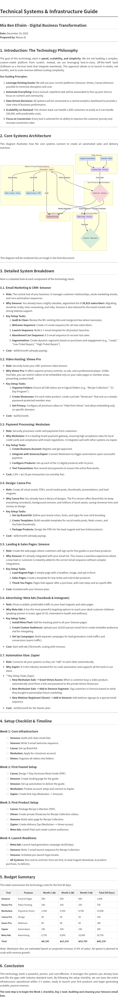

# Technical Systems & Infrastructure Guide
## Mia Ben Efraim - Digital Business Transformation

**Date:** December 19, 2025  
**Prepared by:** Manus AI

---

## 1. Introduction: The Technology Philosophy

The goal of this technology stack is **speed, scalability, and simplicity**. We are not building a complex, custom-coded platform from scratch. Instead, we are leveraging best-in-class, off-the-shelf SaaS (Software as a Service) tools that integrate seamlessly. This approach allows us to launch in weeks, not months, and to scale revenue without scaling complexity.

**Our Guiding Principles:**

1.  **Leverage Existing Assets:** We will use your current platforms (Smoove, Vimeo, Canva) wherever possible to minimize disruption and cost.
2.  **Automate Everything:** Every manual, repetitive task will be automated to free up your time to focus on content and community.
3.  **Data-Driven Decisions:** All systems will be connected to a central analytics dashboard to provide a clear view of business performance.
4.  **Scalability on Demand:** The chosen stack can handle 1,000 customers as easily as it can handle 100,000, with predictable costs.
5.  **Focus on Conversion:** Every tool is selected for its ability to improve the customer journey and increase conversion rates.

---

## 2. Core Systems Architecture

This diagram illustrates how the core systems connect to create an automated sales and delivery machine.

---

## 3. Detailed System Breakdown

Here is a detailed look at each component of the technology stack.

### 3.1. Email Marketing & CRM: **Smoove**

-   **Role:** The central hub of your business. It manages customer relationships, sends marketing emails, and runs automation sequences.
-   **Why Smoove:** You already have a highly valuable, segmented list of **26,823 subscribers**. Migrating would be costly, time-consuming, and risky. Smoove is also tailored for the Israeli market with strong Hebrew support.
-   **Key Setup Tasks:**
    1.  **Audit & Clean:** Review the 80+ existing lists and merge/archive where necessary.
    2.  **Welcome Sequence:** Create a 5-email sequence for all new subscribers.
    3.  **Launch Sequence:** Build a 7-email template for all product launches.
    4.  **Abandoned Cart Sequence:** A 3-email sequence to recover lost sales.
    5.  **Segmentation:** Create dynamic segments based on purchases and engagement (e.g., "Leads," "Low-Ticket Buyers," "High-Ticket Buyers").
-   **Cost:** ~₪500/month (already paying).

### 3.2. Video Hosting: **Vimeo Pro**

-   **Role:** Securely hosts your 248+ premium video lessons.
-   **Why Vimeo Pro:** It offers superior privacy controls, no ads, and a professional player. Unlike YouTube, you can restrict videos to be embedded only on your sales pages or member areas, preventing content theft.
-   **Key Setup Tasks:**
    1.  **Organize Folders:** Ensure all 248 videos are in logical folders (e.g., "Recipe Collection," "21-Day Program").
    2.  **Create Showcases:** For each video product, create a private "Showcase" that acts as a simple, password-protected member area.
    3.  **Set Privacy:** Configure all premium videos to "Hide from Vimeo" and allow embedding only on specific domains.
-   **Cost:** ~₪250/month.

### 3.3. Payment Processing & Invoicing: **iCount**

-   **Role:** Processes credit card payments AND automatically generates invoices (חשבונית מס/קבלה).
-   **Why iCount:** You already have 13+ active payment pages processing 3,406+ sales. It handles payments, invoicing, accounting, and recurring billing all in one system. No need for a separate payment processor.
-   **Key Setup Tasks:**
    1.  **Verify Webhook/API:** Check if iCount can send webhooks to Zapier when a payment is successful.
    2.  **Create New Payment Pages:** Set up pages for the new digital products (Recipe Collection ₪97, etc.).
    3.  **Test Zapier Integration:** Connect iCount to Zapier to trigger product delivery automations.
    4.  **Document Payment URLs:** Save the unique payment links for each product to embed in Smoove landing pages.
-   **Cost:** ₪99-299/month (already paying) + 2.5-3% transaction fees.

### 3.4. Design: **Canva Pro**

-   **Role:** Create all visual assets: PDFs, social media posts, thumbnails, presentations, and lead magnets.
-   **Why Canva Pro:** You already have a library of designs. The Pro version offers Brand Kits (to keep everything consistent), background remover, and millions of stock assets, saving immense time and money on design.
-   **Key Setup Tasks:**
    1.  **Set Up Brand Kit:** Define your brand colors, fonts, and logos for one-click branding.
    2.  **Create Templates:** Build reusable templates for social media posts, Reels covers, and YouTube thumbnails.
    3.  **Package Products:** Design the PDFs for the lead magnet and low-ticket products.
-   **Cost:** ~₪50/month (already paying).

### 3.5. Landing & Sales Pages: **Smoove**

-   **Role:** Create the web pages where customers will sign up for free guides or purchase products.
-   **Why Smoove:** It's already integrated with your email list. This means a seamless experience where a new lead or customer is instantly added to the correct email sequence without complex integrations.
-   **Key Setup Tasks:**
    1.  **Lead Magnet Page:** A simple page with a headline, image, and opt-in form.
    2.  **Sales Pages:** Create a template for low-ticket and mid-ticket products.
    3.  **Thank You Pages:** Pages that appear after a purchase, with next steps and an upsell offer.
-   **Cost:** Included with your Smoove plan.

### 3.6. Advertising: **Meta Ads (Facebook & Instagram)**

-   **Role:** Drives scalable, predictable traffic to your lead magnets and sales pages.
-   **Why Meta Ads:** It has the most powerful targeting options to reach your ideal customer (Hebrew-speaking women in Israel, aged 25-55, interested in health and wellness).
-   **Key Setup Tasks:**
    1.  **Install Meta Pixel:** Add the tracking pixel to all your Smoove pages.
    2.  **Create Custom Audiences:** Upload your 26,823-person email list to create lookalike audiences and for retargeting.
    3.  **Set Up Campaigns:** Build separate campaigns for lead generation (cold traffic) and conversions (warm traffic).
-   **Cost:** Start with ₪6,750/month, scaling with revenue.

### 3.7. Automation Glue: **Zapier**

-   **Role:** Connects all your systems so they can "talk" to each other automatically.
-   **Why Zapier:** It is the industry standard for no-code automation and supports all the tools in our stack.
-   **Key Setup Tasks (Zaps):
    1.  **New Meshulam Sale → Grant Vimeo Access:** When a customer buys a video product, automatically send them a link and password to the private Vimeo Showcase.
    2.  **New Meshulam Sale → Add to Smoove Segment:** Tag customers in Smoove based on what they bought to personalize future marketing.
    3.  **New Webinar Registrant (Zoom) → Add to Smoove:** Add webinar signups to a special email sequence.
-   **Cost:** ~₪100/month for the Starter plan.

---

## 4. Setup Checklist & Timeline

### Week 1: Core Infrastructure
-   [ ] **Smoove:** Audit and clean email lists.
-   [ ] **Smoove:** Write 5-email welcome sequence.
-   [ ] **Canva:** Set up Brand Kit.
-   [ ] **Meshulam:** Apply for a business account.
-   [ ] **Vimeo:** Organize all videos into folders.

### Week 2: First Funnel Setup
-   [ ] **Canva:** Design 7-Day Hormone Reset Guide (PDF).
-   [ ] **Smoove:** Create landing page for the guide.
-   [ ] **Smoove:** Set up automation to deliver the guide.
-   [ ] **Meshulam:** Finalize account setup and connect to Zapier.
-   [ ] **Zapier:** Create first Zap (Meshulam → Smoove).

### Week 3: First Product Setup
-   [ ] **Canva:** Package Recipe Collection (PDF).
-   [ ] **Vimeo:** Create private Showcase for Recipe Collection videos.
-   [ ] **Smoove:** Build sales page for Recipe Collection.
-   [ ] **Zapier:** Create delivery Zap (Meshulam → Vimeo access).
-   [ ] **Meta Ads:** Install Pixel and create custom audiences.

### Week 4: Launch Readiness
-   [ ] **Meta Ads:** Launch lead generation campaign (₪100/day).
-   [ ] **Smoove:** Write 7-email launch sequence for Recipe Collection.
-   [ ] **Smoove:** Schedule pre-launch hype emails.
-   [ ] **All Systems:** Run end-to-end test: from ad click, to lead magnet download, to product purchase, to delivery.

---

## 5. Budget Summary

This table summarizes the technology costs for the first 90 days.

| Tool | Purpose | Month 1 (₪) | Month 2 (₪) | Month 3 (₪) | Total (90 Days) |
|---|---|---|---|---|---|
| **Smoove** | Email & Pages | 500 | 500 | 600 | 1,600 |
| **Vimeo Pro** | Video Hosting | 250 | 250 | 250 | 750 |
| **iCount** | Payments & Invoicing | 200 | 200 | 200 | 600 |
| **Canva Pro** | Design | 50 | 50 | 50 | 150 |
| **Zoom Pro** | Webinars | 60 | 60 | 60 | 180 |
| **Zapier** | Automation | 100 | 100 | 100 | 300 |
| **Meta Ads** | Advertising | 6,750 | 8,000 | 10,000 | 24,750 |
| **Total** | | **₪7,910** | **₪9,160** | **₪11,260** | **₪28,330** |

*Note: iCount fees are already included in the monthly subscription. Transaction fees (2.5-3%) are deducted automatically. Ad spend is planned to scale with revenue growth.*

---

## 6. Conclusion

This technology stack is powerful, proven, and cost-effective. It leverages the systems you already have and fills the gaps with industry-standard tools. By following the setup checklist, we can have the entire infrastructure operational within 2-3 weeks, ready to launch your first products and begin generating scalable, passive revenue.

**The next step is to begin the Week 1 checklist, Day 1 task: Auditing and cleaning your Smoove email lists.**
